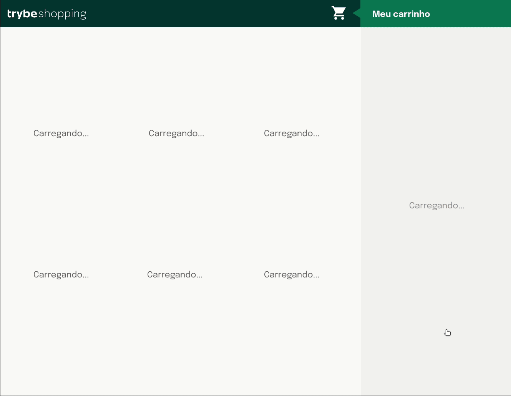
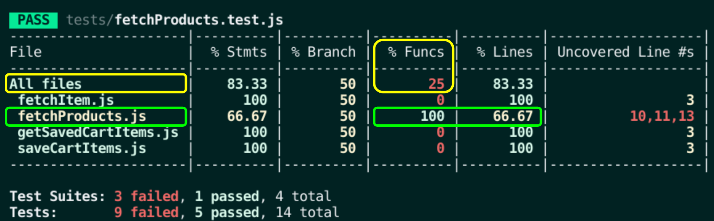

# Boas-vindas ao repositório do projeto Carrinho de Compras!

Projeto de avaliação feito durante o curso da Trybe.

<details>
  <summary><strong>👨‍💻 O que deverá ser desenvolvido</strong></summary><br />

Você vai desenvolver **carrinho de compras** totalmente dinâmico! 🛒

Para isso, vai consumir dados diretamente de uma **API!** 🤩

Isso mesmo! Da sigla em inglês _Application Programming Interface_, uma API é um ponto de contato na internet com determinado serviço e nesse projeto você vai utilizar a API do Mercado Livre para buscar produtos à venda. 🏷

E não para por aí! 🤩

Você já aprendeu sobre a importância de ter uma mentalidade orientada a testes, não é mesmo? E também já sabe como a implementação de testes contribui para a escrita de códigos mais confiáveis e com boa performance. 

Nesse projeto você vai ter a experiência de pôr em prática o desenvolvimento orientado a testes, o famoso TDD (Test Driven Development)! Que te ajuda a garantir um código de qualidade, percebendo os casos de uso da sua aplicação e garantindo que ela está funcionando da maneira correta! 🚀

Ao finalizar o projeto, ele deve ter o comportamento parecido com o gif abaixo:



</details>

# Orientações

<details>
  <summary><strong>Para acessar o projeto</strong></summary><br />

  1. Clone o repositório

  - Use o comando: `git clone git@github.com:priscilaSartori/project-shopping-cart.git`.
  - Entre na pasta do repositório que você acabou de clonar:
    - `cd project-tryunfo`

  2. Instale as dependências

  - `npm install`.
  
  3. Inicie a aplicação
  
  - `npm start`.

</details>

<details>
  <summary><strong>🎛 Linter</strong></summary><br />

### ESLint e Stylelint

Para garantir a qualidade do código, vamos utilizar neste projeto os linters `ESLint` e `Stylelint`.
Assim o código estará alinhado com as boas práticas de desenvolvimento, sendo mais legível
e de fácil manutenção!

Para poder rodar o `ESLint` e o `Stylelint` certifique-se de ter executado o comando `npm install` dentro do projeto.

Para rodá-los localmente no projeto, execute os comandos abaixo:

```bash
  npm run lint
  npm run lint:styles
```

Se a análise do `ESLint` e do `Stylelint` encontrarem problemas no seu código, tais problemas serão mostrados no seu terminal. Se não houver problema no seu código, nada será impresso no seu terminal.

Você pode também instalar o plugin do `ESLint` no VSCode. Para isso, basta fazer o download do plugin `ESLint` e instalá-lo.

Em caso de dúvidas, confira o material do course sobre [ESLint e Stylelint](https://app.betrybe.com/course/real-life-engineer/eslint).

⚠️ **PULL REQUESTS COM ISSUES NO LINTER NÃO SERÃO AVALIADAS. ATENTE-SE PARA RESOLVÊ-LAS ANTES DE FINALIZAR O DESENVOLVIMENTO!** ⚠️

</details>

<details>
  <summary><strong>🛠 Testes</strong></summary><br />

Nesse projeto você vai implementar o TDD (Test Driven Development) também conhecido como _desenvolvimento orientado a testes_, que é uma prática muito utilizada no mercado de trabalho para garantir que o código será implementado da maneira correta. Ou seja, primeiro você vai escrever o teste para uma função e depois vai implementar a lógica para que a função execute.

Você vai ser responsável por implementar testes para quatro funções: `fetchProducts`, `fetchItem`, `saveCartItems` e `getSavedCartItems`. 

### Cobertura de testes

Para avaliar se seus testes estão cobrindo toda a função, será utilizado a **cobertura de testes**, que avalia a eficácia dos testes implementados de acordo com os requisitos, determinando se cobrem o que foi pedido ou não.

⚠️ **Será testado apenas as quatros funções pedidas e não toda a aplicação!**

Conforme você for realizando os testes do projeto, a porcentagem da cobertura total irá aumentar. Para a cobertura total será avaliado 25%, 50%, 75%, e, por fim, 100% dos testes. Para cada função solicitada a cobertura de testes irá avaliar 100% das linhas da sua função.

Para executar seus testes, execute o comando abaixo:

```bash
npm test
```

Para executar e acompanhar a implementação da sua cobertura de testes, rode o comando abaixo:

```bash
npm run test:coverage
```

Ao realizar o comando de cobertura de testes terá um resultado similar a este:



Os destaques em amarelo fazem referência à cobertura total e os em verde do requisito desejado.

Verifique com o comando `npm test` se todos os itens da cobertura dos testes estão passando corretamente.

⚠️ **Atenção:** cuidado com eventuais falso-positivos!

### Pontos importantes para a implementação dos testes

Disponibilizamos a API simulada para você implementar seus testes. Isso significa que será possível simular o consumo de todos os dados da API dentro do seu ambiente de testes, de forma segura e independente de fatores externos que possam ocorrer.

- As funções `fetchProducts` e `fetchItem` devem ser implementadas por você;

- Os retornos esperados das funções já estão importados nos arquivos de teste e vão estar especificados nos requisitos;

- O `window.fetch` está definido em todos os testes, ou seja, será possível usar a função `fetch` dentro do seu ambiente de testes sem precisar importar ou instalar bibliotecas;

- Utilize o `localStorage.getItem` e o `localStorage.setItem` normalmente no ambiente de teste, pois a simulação dele está pronta para ser chamada quando necessário;

- Para nosso ambiente de testes, o `fetch` está limitado a atender somente a configuração da API referente ao projeto;

- Deseja checar se uma função foi chamada? Ou se foi chamada com um argumento específico? Que tal dar uma olhada nos matchers da [documentação](https://jestjs.io/pt-BR/docs/expect#tohavebeencalled).

Para avaliar o seu projeto como um todo, será utilizado o _Cypress_.

### Cypress

Cypress é uma ferramenta de teste de front-end desenvolvida para a web.

Antes de utilizá-lo, certifique-se de ter executado o comando `npm install` dentro do projeto.

Você pode rodar o cypress localmente para verificar se seus requisitos estão passando, para isso execute um dos seguintes comandos:

Para executar os testes e vê-los rodando em uma janela de navegador:

```bash
npm run cy:open
```

ou

```bash
npx cypress open
```

Após executar um dos comandos acima, será aberta uma janela de navegador e então basta clicar no nome do arquivo de teste que quiser executar (project.spec.js), ou para executar todos os testes clique em _Run all specs_.

Você também pode assistir a [este](https://vimeo.com/539240375/a116a166b9) vídeo 😉🎙

⚠️ **Atente-se para os nomes de classes que alguns elementos de seu projeto devem possuir**. O não cumprimento de um requisito, total ou parcialmente, impactará em sua avaliação.

</details>

<details>
<summary><strong>🏗 Estrutura do projeto</strong></summary><br />

O seu _Pull Request_ deverá conter os arquivos `index.html`, `style.css` e `script.js`, que conterão seu código HTML, CSS e JavaScript, respectivamente. 

O arquivo `scripts.js` contém uma estrutura de código inicial, que cria alguns elementos HTML. Leia cada função atentamente para entender o que o código está fazendo. 

Não se preocupe! O requisito vai informar quando for necessário utilizar as funções já existentes.

É no `script.js` que você vai implementar a lógica para desenvolver o projeto. Fique à vontade para criar novas funções desde que elas estejam dentro do `script.js`. 😉

<details>
  <summary>
    Clique aqui para saber um pouco mais sobre o que cada função faz
  </summary> <br />

  - `createProductImageElement`: Cria um elemento de imagem;
  - `createCustomElement`: Estrutura para criar um elemento;
  - `createProductItemElement`: Cria a lista de produtos;
  - `getIdFromProductItem`: Pega o `id` de um produto;
  - `cartItemClickListener`: Escuta a ação de clicar em um item no carrinho;
  - `createCartItemElement`: Cria os elementos do carrinho.

</details>

A pasta `helpers` contém os arquivos `fetchItem.js`, `fetchProducts.js`, `getSavedCartItems.js` e `saveCartItems.js` e cada um possui uma estrutura para você implementar cada uma das funções que serão utilizadas seu código JavaScript.

⚠️ **Atenção:** Esses arquivos já estão importados dentro do seu arquivo `index.html`, portanto **NÃO** devem ser importados dentro do arquivo `script.js`, porque podem causar erro de importação no seu código.

A pasta `tests`, contém os arquivos `fetchItem.test.js`, `fetchProducts.test.js`, `getSavedCartItems.test.js` e `saveCartItems.test.js`, onde você vai implementar os testes para cada uma das funções de mesmo nome.

⚠️ É importante que seus arquivos tenham exatamente estes nomes! ⚠️

Caso você faça o download de bibliotecas externas, utilize o diretório `libs` (a partir da raiz do projeto) para colocar os arquivos (*.css, *.js, etc.) baixados.

Você pode adicionar outros arquivos se julgar necessário. Qualquer dúvida, poste no _Slack_.

</details>

<details>
<summary><strong>⚙️ API do Mercado Livre</strong></summary><br />

O [manual da API do Mercado Livre](https://developers.mercadolivre.com.br/pt_br/itens-e-buscas) contém todas as informações acerca da API (retorno, estrutura). Nesse projeto você vai precisar apenas de alguns dos _endpoints_, sendo eles:

- `https://api.mercadolibre.com/sites/MLB/search?q=$QUERY`: traz uma lista de produtos, onde `$QUERY` é o termo a ser buscado. Por exemplo, se o termo for `computador`, o retorno será parecido com esse:

  <details>
    <summary>Retorno da requisição de listagem de produtos</summary>

    Esse retorno possui várias informações acerca da lista de produtos. Dento do array `results` é onde você vai encontrar a lista de produtos.

  ```json
  {
      "site_id": "MLB",
      "query": "computador",
      "paging": {
          "total": 406861,
          "offset": 0,
          "limit": 50,
          "primary_results": 1001
      },
      "results": [
          {
              "id": "MLB1341925291",
              "site_id": "MLB",
              "title": "Processador Intel Core I5-9400f 6 Núcleos 128 Gb",
              "seller": {
                  "id": 385471334,
                  "permalink": null,
                  "power_seller_status": null,
                  "car_dealer": false,
                  "real_estate_agency": false,
                  "tags": []
              },
              "price": 899,
              "currency_id": "BRL",
              "available_quantity": 1,
              "sold_quantity": 0,
              "buying_mode": "buy_it_now",
              "listing_type_id": "gold_pro",
              "stop_time": "2039-10-10T04:00:00.000Z",
              "condition": "new",
              "permalink": "https://www.mercadolivre.com.br/processador-intel-core-i5-9400f-6-nucleos-128-gb/p/MLB13953199",
              "thumbnail": "http://mlb-s2-p.mlstatic.com/813265-MLA32241773956_092019-I.jpg",
              "accepts_mercadopago": true,
              "installments": {
                  "quantity": 12,
                  "amount": 74.92,
                  "rate": 0,
                  "currency_id": "BRL"
              },
              "address": {
                  "state_id": "BR-SP",
                  "state_name": "São Paulo",
                  "city_id": "BR-SP-27",
                  "city_name": "São José dos Campos"
              },
              "shipping": {
                  "free_shipping": true,
                  "mode": "me2",
                  "tags": [
                      "fulfillment",
                      "mandatory_free_shipping"
                  ],
                  "logistic_type": "fulfillment",
                  "store_pick_up": false
              },
              "seller_address": {
                  "id": "",
                  "comment": "",
                  "address_line": "",
                  "zip_code": "",
                  "country": {
                      "id": "BR",
                      "name": "Brasil"
                  },
                  "state": {
                      "id": "BR-SP",
                      "name": "São Paulo"
                  },
                  "city": {
                      "id": "BR-SP-27",
                      "name": "São José dos Campos"
                  },
                  "latitude": "",
                  "longitude": ""
              },
              "attributes": [
                  {
                      "source": 1,
                      "id": "ALPHANUMERIC_MODEL",
                      "value_id": "6382478",
                      "value_struct": null,
                      "values": [
                          {
                              "name": "BX80684I59400F",
                              "struct": null,
                              "source": 1,
                              "id": "6382478"
                          }
                      ],
                      "attribute_group_id": "OTHERS",
                      "name": "Modelo alfanumérico",
                      "value_name": "BX80684I59400F",
                      "attribute_group_name": "Outros"
                  },
                  {
                      "id": "BRAND",
                      "value_struct": null,
                      "attribute_group_name": "Outros",
                      "attribute_group_id": "OTHERS",
                      "source": 1,
                      "name": "Marca",
                      "value_id": "15617",
                      "value_name": "Intel",
                      "values": [
                          {
                              "id": "15617",
                              "name": "Intel",
                              "struct": null,
                              "source": 1
                          }
                      ]
                  },
                  {
                      "name": "Condição do item",
                      "value_id": "2230284",
                      "attribute_group_id": "OTHERS",
                      "attribute_group_name": "Outros",
                      "source": 1,
                      "id": "ITEM_CONDITION",
                      "value_name": "Novo",
                      "value_struct": null,
                      "values": [
                          {
                              "id": "2230284",
                              "name": "Novo",
                              "struct": null,
                              "source": 1
                          }
                      ]
                  },
                  {
                      "id": "LINE",
                      "value_name": "Core i5",
                      "attribute_group_id": "OTHERS",
                      "attribute_group_name": "Outros",
                      "name": "Linha",
                      "value_id": "7769178",
                      "value_struct": null,
                      "values": [
                          {
                              "id": "7769178",
                              "name": "Core i5",
                              "struct": null,
                              "source": 1
                          }
                      ],
                      "source": 1
                  },
                  {
                      "id": "MODEL",
                      "value_struct": null,
                      "values": [
                          {
                              "id": "6637008",
                              "name": "i5-9400F",
                              "struct": null,
                              "source": 1
                          }
                      ],
                      "attribute_group_id": "OTHERS",
                      "name": "Modelo",
                      "value_id": "6637008",
                      "value_name": "i5-9400F",
                      "attribute_group_name": "Outros",
                      "source": 1
                  }
              ],
              "differential_pricing": {
                  "id": 33580182
              },
              "original_price": null,
              "category_id": "MLB1693",
              "official_store_id": null,
              "catalog_product_id": "MLB13953199",
              "tags": [
                  "brand_verified",
                  "good_quality_picture",
                  "good_quality_thumbnail",
                  "immediate_payment",
                  "cart_eligible"
              ],
              "catalog_listing": true
          },
      ]
  }
  ```
  </details>

- `https://api.mercadolibre.com/items/$ItemID`: traz detalhes de um determinado produto, onde `$ItemID` é o `id` do produto a ser buscado. Por exemplo, se o `id` do produto for `MLB1341706310`, o retorno será parecido com esse:

  <details>
    <summary>Retorno da requisição de detalhes de um produto</summary>

    Esse retorno traz informações detalhadas sobre cada um dos produtos. Por exemplo, o `id` desse produto, o `title`, que o título do produto, `price`, que é o preço e assim por diante.


  ```json
  {
    "id": "MLB1341706310",
    "site_id": "MLB",
    "title": "Processador Gamer Amd Ryzen 5 2600 Yd2600bbafbox De 6 Núcleos E 3.9ghz De Frequência",
    "subtitle": null,
    "seller_id": 245718870,
    "category_id": "MLB1693",
    "official_store_id": 1929,
    "price": 1068,
    "base_price": 1068,
    "original_price": null,
    "currency_id": "BRL",
    "initial_quantity": 93,
    "available_quantity": 0,
    "sold_quantity": 50,
    "sale_terms": [],
    "buying_mode": "buy_it_now",
    "listing_type_id": "gold_special",
    "start_time": "2019-10-15T18:13:00.000Z",
    "stop_time": "2040-01-27T00:26:51.000Z",
    "condition": "new",
    "permalink": "https://produto.mercadolivre.com.br/MLB-1341706310-processador-gamer-amd-ryzen-5-2600-yd2600bbafbox-de-6-nucleos-e-39ghz-de-frequncia-_JM",
    "thumbnail_id": "852106-MLA42157659481_062020",
    "thumbnail": "http://http2.mlstatic.com/D_852106-MLA42157659481_062020-I.jpg",
    "secure_thumbnail": "https://http2.mlstatic.com/D_852106-MLA42157659481_062020-I.jpg",
    "pictures": [],
    "video_id": null,
    "descriptions": [
    ],
    "accepts_mercadopago": true,
    "non_mercado_pago_payment_methods": [
    ],
    "shipping": {},
    "international_delivery_mode": "none",
    "seller_address": {},
    "seller_contact": null,
    "location": {
    },
    "coverage_areas": [
    ],
    "attributes": [],
    "warnings": [
    ],
    "listing_source": "",
    "variations": [
    ],
    "status": "paused",
    "sub_status": [],
    "tags": [],
    "warranty": "Garantia de fábrica: 3 anos",
    "catalog_product_id": "MLB9196241",
    "domain_id": "MLB-COMPUTER_PROCESSORS",
    "parent_item_id": null,
    "differential_pricing": null,
    "deal_ids": [
    ],
    "automatic_relist": false,
    "date_created": "2019-10-15T18:13:00.000Z",
    "last_updated": "2022-02-05T06:46:48.434Z",
    "health": null,
    "catalog_listing": true,
    "channels": []
  }
  ```

  </details>

  </details>

  <details>
    <summary><strong>💻 Protótipo do projeto no Figma</strong></summary><br />

  Além da qualidade do código e do atendimento aos requisitos, um bom layout é um dos aspectos responsáveis por melhorar a usabilidade de uma aplicação e turbinar seu portfólio!

  Você pode estar se perguntando: *"Como deixo meu projeto com um layout mais atrativo?"* 🤔

  Para isso, disponibilizamos esse [protótipo do Figma](https://www.figma.com/file/7Okk4tKMFcjNFoGX5rR677/%5BProjeto%5D%5BFrontend%5D-Carrinho-de-Compras?node-id=0%3A1) para lhe ajudar !

  ⚠️ A estilização de sua aplicação não será avaliada nesse projeto, portanto esse protótipo é apenas uma **sugestão** e seu uso é **opcional**. Sinta-se à vontade para modificar o layout e deixá-lo do seu jeito.

  </details>

# Requisitos Obrigatórios

## 1. (TDD) Desenvolva testes de no mínimo 25% de cobertura total e 100% da função `fetchProducts`

<details>
  <summary>
    Implemente os testes necessários na função <code>fetchProducts</code>
  </summary> <br />

O arquivo para implementar o teste já está criado, se chama `fetchProducts.test.js` e se encontra dentro da pasta `tests`.

**O que você deve testar:**

- Teste se `fetchProducts` é uma função;

- Execute a função `fetchProducts` com o argumento `'computador'` e teste se `fetch` foi chamada;

- Teste se, ao chamar a função `fetchProducts` com o argumento `'computador'`, a função `fetch` utiliza o endpoint `'https://api.mercadolibre.com/sites/MLB/search?q=computador'`;

- Teste se o retorno da função `fetchProducts` com o argumento `'computador'` é uma estrutura de dados igual ao objeto `computadorSearch`, que já está importado no arquivo.

- Teste se, ao chamar a função `fetchProducts` sem argumento, retorna um erro com a mensagem: `'You must provide an url'`.

> **De olho na dica 👀:** Lembre-se de usar o `new Error('mensagem esperada aqui')` para comparar com o objeto retornado da API.
> Leia com bastante atenção o que está sendo solicitado e implemente um teste de cada vez!

⚠️ **Atenção:** Você deve implementar todos os testes acima, independente do que for suficiente para a cobertura de testes.

**O que será testado:**

- Será avaliado se os testes implementados atingem no mínimo 25% da cobertura total e 100% da função `fetchProducts`.

</details>

## 2. Crie uma listagem de produtos

<details>
  <summary>
    Utilize a função <code>fetchProducts</code> para criar uma listagem de produtos através da API do Mercado Livre.
  </summary> <br />

O arquivo da função `fetchProducts` já está criado e se encontra dentro da pasta `helpers` e já está sendo importado dentro do arquivo HTML.

A função `fetchProducts` deverá ser responsável por realizar a requisição e retornar os resultados da API.

Implemente a função `fetchProducts`;

- Utilize o _endpoint_ `https://api.mercadolibre.com/sites/MLB/search?q=$QUERY`, onde:

  - O valor de `$QUERY` representa o termo que será buscado na API, esse valor deve ser **obrigatoriamente** o termo `computador`;

  - O retorno de produtos se encontra no array `results`;

<details>
<summary>Clique aqui para ver o retorno da API</summary>

```json
{
  "site_id": "MLB",
  "country_default_time_zone": "GMT-03:00",
  "query": "computador",
  "paging": {...},
  "results": [
    {
      "id": "MLB2025368730",
      "site_id": "MLB",
      "title": "Computador Completo Fácil Intel Core I3 8gb Ssd 240gb ",
      "seller": {},
      "price": 1859.07,
      "prices": {},
      "sale_price": null,
      "currency_id": "BRL",
      "available_quantity": 100,
      "sold_quantity": 500,
      "buying_mode": "buy_it_now",
      "listing_type_id": "gold_pro",
      "stop_time": "2041-09-12T04:00:00.000Z",
      "condition": "new",
      "permalink": "https://produto.mercadolivre.com.br/MLB-2025368730-computador-completo-facil-intel-core-i3-8gb-ssd-240gb-_JM",
      "thumbnail": "http://http2.mlstatic.com/D_704139-MLB47542929423_092021-I.jpg",
      "thumbnail_id": "704139-MLB47542929423_092021",
      "accepts_mercadopago": true,
      "installments": {},
      "address": {},
      "shipping": {},
      "seller_address": {},
      "attributes": [],
      "differential_pricing": {},
      "original_price": 1999,
      "category_id": "MLB1649",
      "official_store_id": 3807,
      "domain_id": "MLB-DESKTOP_COMPUTERS",
      "catalog_product_id": null,
      "tags": [],
      "order_backend": 1,
      "use_thumbnail_id": true,
      "offer_score": null,
      "offer_share": null,
      "match_score": null,
      "winner_item_id": null,
      "melicoin": null,
      "discounts": null
    },
    // {...} restante da lista de produtos
  ],
  "sort": {...},
  "available_sorts": {...},
  "filters": {...},
  "available_filters": {...}
}

```
</details>

Para executar sua função `fetchProducts` basta chama-lá no seu arquivo `script.js`.

---

Com os dados em mãos, você deverá utilizar a função `createProductItemElement()` para criar os componentes _HTML_ referentes a cada um dos produtos retornados pela API:
> Essa função já está implementada no `script.js`
  - Adicione cada elemento retornado da função `createProductItemElement(product)` como filho do elemento `<section class="items">`.

**O que será testado:**

- O elemento com classe `.item` deve ser cada item da lista de produtos.

</details>

## 3. (TDD) Desenvolva testes de no mínimo 50% de cobertura total e 100% da função `fetchItem`

<details>
  <summary>
    Implemente os testes necessários na função <code>fetchItem</code>
  </summary> <br />

**O que você deve testar:**

- Teste se `fetchItem` é uma função;

- Execute a função `fetchItem` com o argumento do item "MLB1615760527" e teste se `fetch` foi chamada;

- Teste se, ao chamar a função `fetchItem` com o argumento do item "MLB1615760527", a função `fetch` utiliza o endpoint "https://api.mercadolibre.com/items/MLB1615760527";

- Teste se o retorno da função `fetchItem` com o argumento do item "MLB1615760527" é uma estrutura de dados igual ao objeto `item` que já está importado no arquivo.

- Teste se, ao chamar a função `fetchItem` sem argumento, retorna um erro com a mensagem: `'You must provide an url'`.

> **De olho na dica 👀:** Lembre-se de usar o `new Error('mensagem esperada aqui')` para comparar com o objeto retornado da API.
> Leia com bastante atenção o que está sendo solicitado e implemente um teste de cada vez!

**O que será testado:**

- Será avaliado se os testes implementados atingem no mínimo 50% da cobertura total e 100% da função `fetchItem`.

</details>

## 4. Adicione o produto ao carrinho de compras

<details>
  <summary>
    Implemente a função <code>fetchItem</code> para retornar dados de um produto e adicioná-lo ao carrinho.
  </summary> <br />

Cada produto na página _HTML_ possui um botão com o nome `Adicionar ao carrinho` e, ao clicar nesse botão, você deve realizar uma requisição que vai retornar todos os detalhes de um produto.

- Implemente a função `fetchItem` para fazer a requisição dos detalhes de apenas **um** produto;

- Utilize o _endpoint_ `https://api.mercadolibre.com/items/$ItemID`, onde `$ItemID` é o `id` do produto a ser buscado;

- Utilize a função `createCartItemElement()` para criar os componentes _HTML_ referentes a um item do carrinho;

- Adicione o elemento retornado da função `createCartItemElement(product)` como filho do elemento `<ol class="cart__items">`.

Por exemplo, se o `id` do produto for `MLB1341706310`, o retorno do _endpoint_ será algo no formato:

<details>
<summary><strong>Clique aqui para ver o retorno da API</strong></summary>

```json
{
    "id": "MLB1341706310",
    "site_id": "MLB",
    "title": "Processador Amd Ryzen 5 2600 6 Núcleos 64 Gb",
    "subtitle": null,
    "seller_id": 245718870,
    "category_id": "MLB1693",
    "official_store_id": 1929,
    "price": 879,
    "base_price": 879,
    "original_price": null,
    "currency_id": "BRL",
    "initial_quantity": 0,
    "available_quantity": 0,
    "sold_quantity": 0,
    //[...]
    "warranty": "Garantia de fábrica: 3 anos",
    "catalog_product_id": "MLB9196241",
    "domain_id": "MLB-COMPUTER_PROCESSORS",
    "parent_item_id": null,
    "differential_pricing": null,
    "deal_ids": [],
    "automatic_relist": false,
    "date_created": "2019-10-15T18:13:00.000Z",
    "last_updated": "2019-12-20T18:06:54.000Z",
    "health": null,
    "catalog_listing": true
}
```
</details>

**O que será testado:**

- O elemento com classe `.cart__items` deve adicionar o item escolhido, apresentando corretamente suas informações de id, título e preço.

</details>

## 5. Remova o item do carrinho de compras ao clicar nele

<details>
  <summary>
    Ao clicar no <strong>produto no carrinho de compra</strong>, ele deve ser removido da lista.
  </summary> <br />

Ao clicar em um dos itens do carrinho de compras, esse item deve ser removido da lista. Para isso:

**O que será testado:**

- Remova o item do carrinho de compras ao clicar nele;

</details>

## 6. (TDD) Desenvolva testes de no mínimo 75% de cobertura total e 100% da função `saveCartItems`

<details>
  <summary>
    Implemente os testes necessários na função <code>saveCartItems</code>
  </summary> <br />

O arquivo para implementar o teste já está criado, se chama `saveCartItems.test.js` e se encontra dentro da pasta `tests`.

⚠️ **Atenção:** Não altere a estrutura já implementada nos arquivos de testes, apenas adicione os testes dentro do bloco `describe`.

**O que você deve testar:**

- Teste se, ao executar `saveCartItems` com um `cartItem` como argumento, o método `localStorage.setItem` é chamado;

- Teste se, ao executar `saveCartItems` com um `cartItem` como argumento, o método `localStorage.setItem` é chamado com dois parâmetros, sendo o primeiro a chave 'cartItems' e o segundo sendo o valor passado como argumento para `saveCartItems`.

⚠️ **Atenção:** Você deve implementar todos os testes acima, independente do que for suficiente para a cobertura de testes.

**O que será testado:**

- Será avaliado se os testes implementados atingem no mínimo 75% da cobertura total e 100% da função `saveCartItems`.

</details>

## 7. (TDD) Desenvolva testes para atingir 100% de cobertura total e 100% da função `getSavedCartItems`

<details>
  <summary>
    Implemente os testes necessários na função <code>getSavedCartItems</code>
  </summary> <br />

O arquivo para implementar o teste já está criado, se chama `getSavedCartItems.test.js` e se encontra dentro da pasta `tests`.

⚠️ **Atenção:** Não altere a estrutura já implementada nos arquivos de testes, apenas adicione os testes dentro do bloco `describe`.

**O que você testar:**

- Teste se, ao executar `getSavedCartItems`, o método `localStorage.getItem` é chamado;

- Teste se, ao executar `getSavedCartItems`, o método `localStorage.getItem` é chamado com o 'cartItems' como parâmetro.

⚠️ **Atenção:** Você deve implementar todos os testes acima, independente do que for suficiente para a cobertura de testes.

**O que será testado:**

- Será avaliado se os testes implementados atingem 100% da cobertura total e 100% da função `getSavedCartItems`.

</details>

## 8. Carregue o carrinho de compras ao iniciar a página

<details>
  <summary>
    Salve os itens adicionados no carrinho de compras no <code>localStorage</code>
  </summary> <br />

Ao carregar a página, o estado atual do carrinho de compras deve ser carregado do **LocalStorage**. Para que isso funcione, os itens do carrinho de compras devem ser salvos no **LocalStorage**, ou seja, a **adição** e **remoção** de um produto devem ser abordadas para que a lista esteja sempre atualizada.

Para isso, você terá de implementar as funções `saveCartItems` e `getSavedCartItems` que já estão criadas com o nome `saveCartItems.js` e `getSavedCartItems.js`, respectivamente, dentro da pasta `helpers`.

- Implemente a função `saveCartItems` que deve possuir a lógica para apenas **adicionar** o item no `localStorage` em uma chave chamada `cartItems`;

- Implemente a função `getSavedCartItems` que deve possuir a lógica para apenas **retornar** o item do `localStorage`.

⚠️ A função `saveCartItems` **não** deve recuperar os itens do `localStorage`. A função `getSavedCartItems` **não** deve adicionar um item no `localStorage`.

**O que será testado:**

- A página ao ser atualizada deve permanecer com todos os itens do carrinho adicionados anteriormente.

</details>

## 9. Calcule o valor total dos itens do carrinho de compras

<details>
  <summary>
    O elemento com o valor <strong>total</strong> dos produtos deve possuir a classe <code>total-price</code>
  </summary> <br />

Cada vez que o carrinho de compras é modificado, será necessário calcular o valor total dos produtos e apresentá-los na página principal do projeto. Para isso:

- Implemente uma lógica para somar todos os produtos do carrinho;

- Crie um elemento com a classe `total-price` e adicione o texto com o valor total dos produtos;

> **Lembre-se 💭:** Ao adicionar um produto no carrinho é realizada uma requisição para a API. Certifique-se de que a API já retornou as informações antes de realizar a soma dos produtos.

> **De olho na dica 👀:** Não utilize o `toFixed()`, encontre outras alternativas para arredondar valores.

**O que será testado:**

- Calcule o valor total dos itens do carrinho de compras de forma assíncrona;

</details>

## 10. Limpe o carrinho de compras

<details>
  <summary>
    Implemente a lógica no botão <code>Esvaziar carrinho</code> para limpar o carrinho de compras
  </summary> <br />

O botão para esvaziar o carrinho já está implementado, mas ele ainda não cumpre seu objetivo. Para isso:

- Certifique-se que o botão possui **obrigatoriamente** a classe `empty-cart`;

- Implemente a lógica para remover **todos** os itens do carrinho de compras;

**O que será testado:**

- Verifica o botão para limpar carrinho de compras;

</details>

## 11. Adicione um texto de `carregando` durante uma requisição à API

<details>
  <summary>
    Adicione um elemento com o texto <code>carregando...</code> durante a requisição à API
  </summary> <br />

Uma requisição à API gasta um certo tempo e durante esse processo a pessoa que está utilizando a página não tem como saber se a requisição deu certo ou não. Por isso, normalmente é utilizada alguma forma para mostrar que a requisição ainda está em andamento. Para isso:

- Crie um elemento que contenha o texto `carregando...`, que deve ser exibido em algum lugar da página;

- Adicione a classe `loading` ao elemento que possui o texto `carregando...`;

- Exiba esse elemento apenas **durante** a requisição à API.

> **De olho na dica 👀:** Você pode criar uma função que adicione ao DOM o elemento com o texto `carregando...` e outra para retirá-lo, o que acha?

**O que será testado:**

- Verifica se adiciona um texto de "carregando" durante uma requisição à API.

</details>
